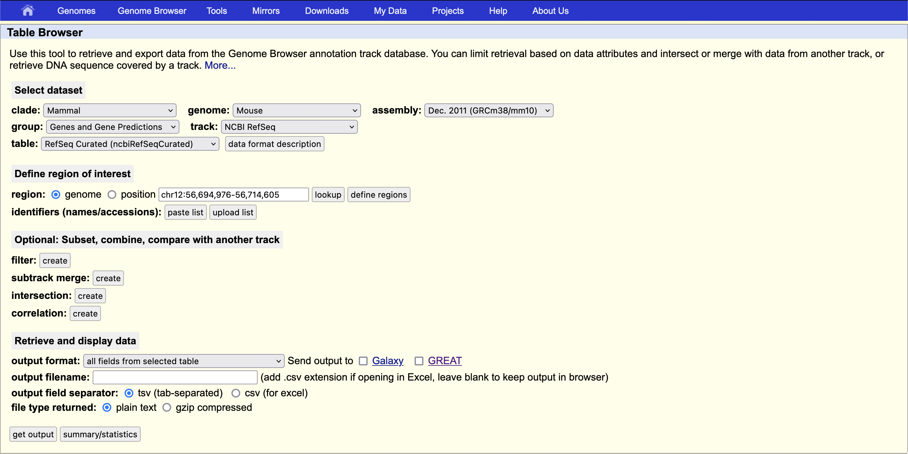

# mm10 UCSC refgene
Obtained from the UCSC table browser using the [URL](https://genome.ucsc.edu/cgi-bin/hgTables?hgsid=1600886239_9yvbkY4gxrx9IqBp0ZtbH4pg3bUw&clade=mammal&org=Mouse&db=0&hgta_group=genes&hgta_track=refSeqComposite&hgta_table=ncbiRefSeqCurated&hgta_regionType=genome&position=&hgta_outputType=bed&hgta_outFileName=)
Settings used are also captured in the screenshot below

This file is primarily intended to be used with ATAQV
A # before the first column was removed manually to work with the ATAQV script